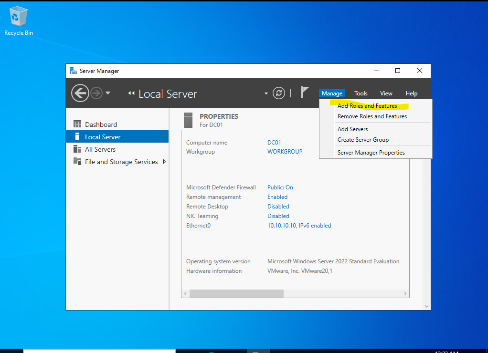
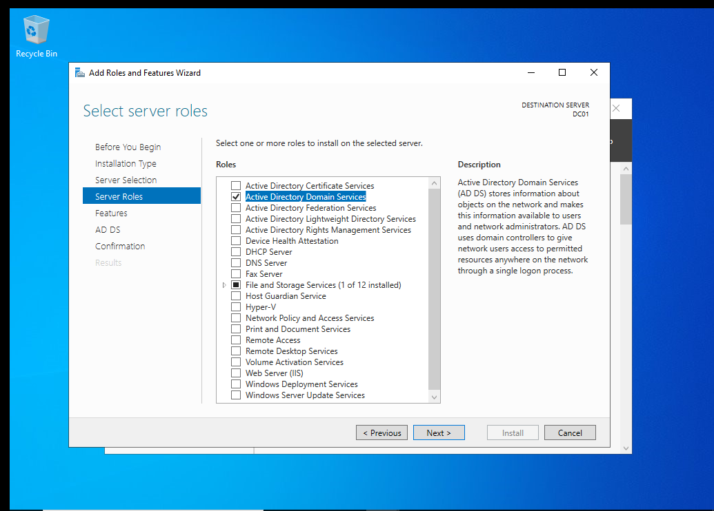
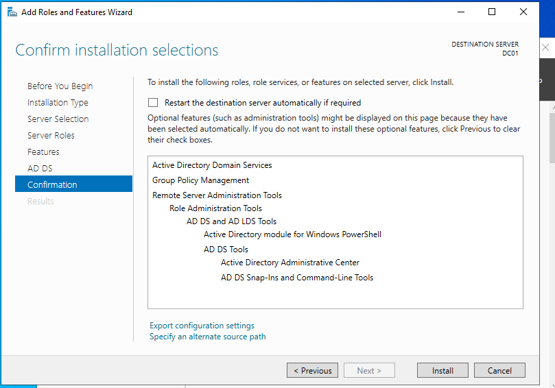
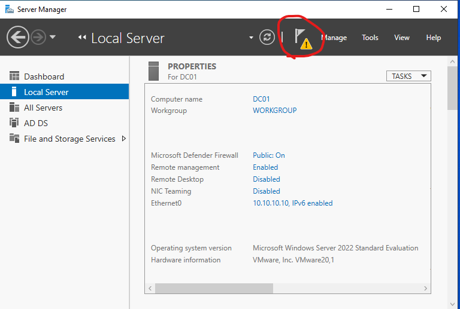
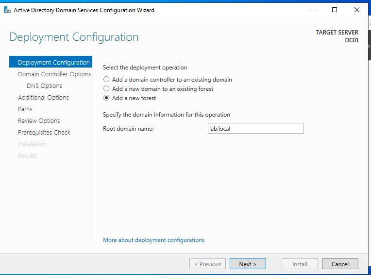
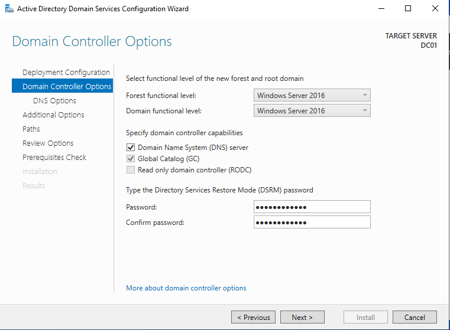

# Windows Server 2022 Installation & Active Directory Setup (DC01)

## Overview
This document outlines the complete process of building a Windows Server 2022 Domain Controller (DC01) using VMware Workstation Pro, including virtual machine setup, OS installation, and Active Directory Domain Services (AD DS) deployment.

---

# 🖥️ Virtual Machine Creation

### 1. Create New VM


- Open VMware Workstation Pro
- Select **Create a New Virtual Machine**
- Choose **Typical (Recommended)**

---

### 2. Boot from ISO


- Power on VM
- Press **ESC** → Boot Menu
- Select **CD/DVD Drive**

---

### 3. Windows Setup


- Select language → Next
- Click **Install Now**

---

### 4. Windows Installed


- Installation complete
- Login as Administrator

---

# ⚙️ Hardware Configuration

- CPU: 2 cores  
- RAM: 4 GB  
- Disk: 60 GB (NVMe)  
- Network: **VMnet1 (Host-only)**  

---

# ⚠️ Pre-Installation Configuration

### Remove Floppy Drive
- VM Settings → Remove Floppy  or power off connection
- Prevents installation errors  

### Configure ISO
- Mount Windows Server 2022 ISO  
- Enable:
  - Connected  
  - Connect at power on  

---

# 🌐 Network Configuration

- Set static IP:

```plaintext
IP Address: 10.10.10.10
Subnet Mask: 255.255.255.0
DNS Server: 10.10.10.10

```
# 🧱 Active Directory Domain Services (AD DS) Installation

## 1. Install AD DS Role

- Open **Server Manager**
- Click **Manage → Add Roles and Features**

  



- Select **Active Directory Domain Services**



 -Click **Next - Next - Next**
 -Confrim installation selections **click → Install**
 dc01-ad-10-confrim-installation.png
 
 
  

---

## 2. Promote Server to Domain Controller

- Click the notification flag in Server Manager
- Select **Promote this server to a domain controller**
  


## Deployment Cofiguration 
- Select **Add a new forest**
- Domain name: ** lab.local**
- Note: This lab uses `lab.local` as the domain name. You can use any name you prefer. If you plan to publish or expose your environment, choose a unique name to avoid conflicts.
  

---

## 3. Deployment Configuration
-Keep as picture.
-Type pasword.




