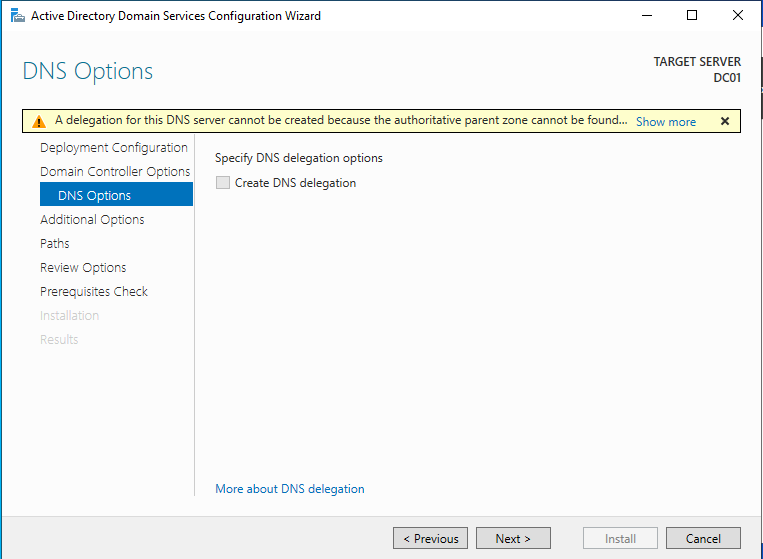
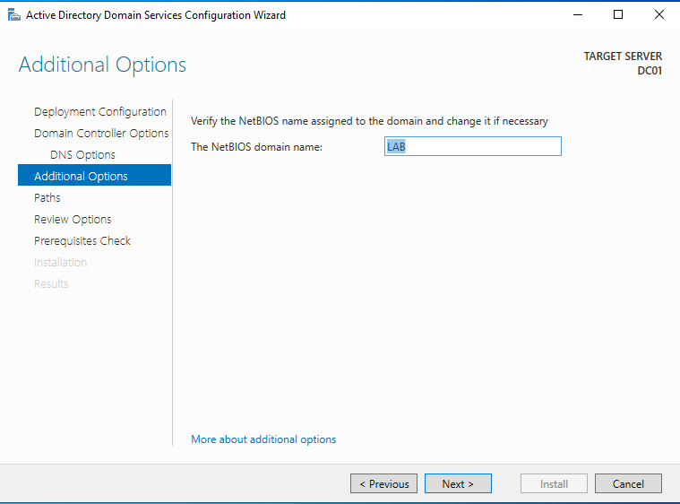
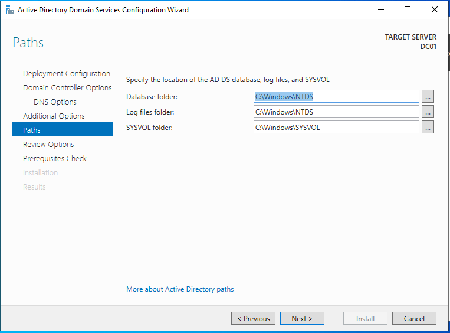
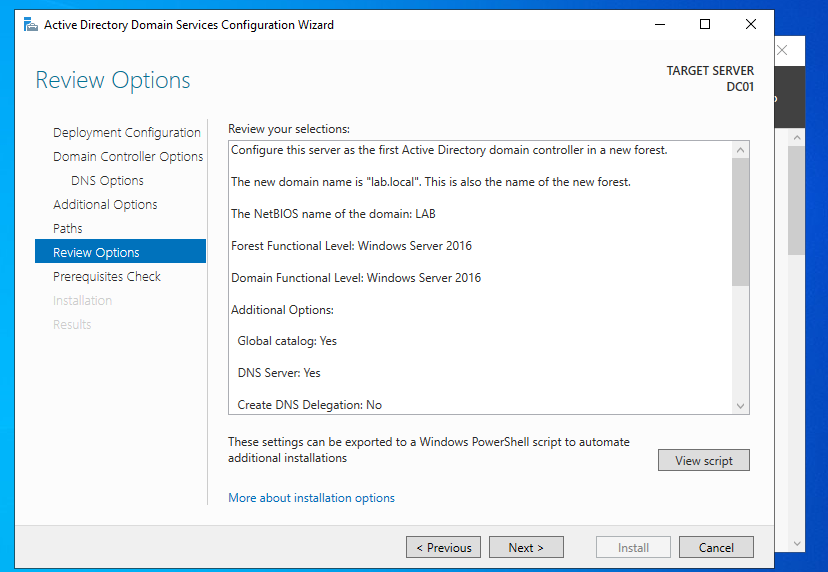
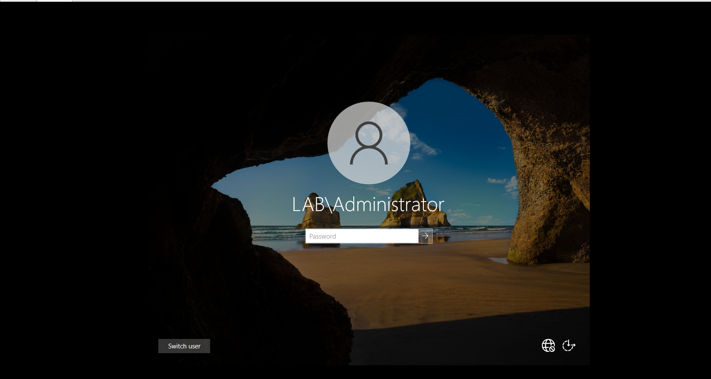

# Windows Server 2022 Installation (DC01) - VMware

## Overview
This section documents the process of creating and installing a Windows Server 2022 virtual machine (DC01) using VMware Workstation Pro.

---

## Virtual Machine Creation

### 1. Create New VM

- Open VMware Workstation Pro
- Select: **Create a New Virtual Machine**
- Choose: **Typical (Recommended)**

### 2. Boot from ISO

- Power on virtual machine
- Press **ESC** to open boot menu
- Select: **CD/DVD Drive**

### 3. Windows Setup

- Select language and keyboard → Next
- Click: Install Now

### 4. Windows Installed

- Windows Server installation completed
- Login with Administrator account

---

## Hardware Configuration

### CPU
- 2 processors

### Memory
- 4 GB (minimum recommended)

### Hard Disk
- Size: 60 GB
- Disk Type: **NVMe (Recommended)**
- Store as a single file

### Network Adapter
- Custom: **VMnet1 (Host-only)**

---

## Important Pre-Installation Configuration

### Remove Floppy Drive
- VM Settings → Floppy → Remove  
- (Prevents installation errors)

### Configure CD/DVD
- Use ISO image file (Windows Server 2022 ISO)
- Enable:
  - Connected
  - Connect at power on

---

## Active Directory Installation

### 1. Add AD DS Role

- Open Server Manager
- Click **Add Roles and Features**
- Select **Active Directory Domain Services**

---

### 2. Configure Domain

- Select: **Add a new forest**
- Root domain name: `lab.local`

---

### 3. DNS Options

- Leave default settings
- Ignore delegation warning (normal in lab)

---

### 4. NetBIOS Name

- Confirm NetBIOS name: `LAB`

---

### 5. AD Paths

- Keep default paths:
  - `C:\Windows\NTDS`
  - `C:\Windows\SYSVOL`

---

### 6. Review Configuration

- Review all settings before installation

---

### 7. Prerequisites Check

- Ensure all checks pass
- Ignore warnings if no critical errors

---

### 8. Domain Login

- Server restarts after installation
- Login using:
  - `LAB\Administrator`

---

## Outcome

A fully configured Windows Server 2022 Domain Controller (DC01) with Active Directory Domain Services installed and ready for further configuration (Group Policy, users, domain join, etc.).
