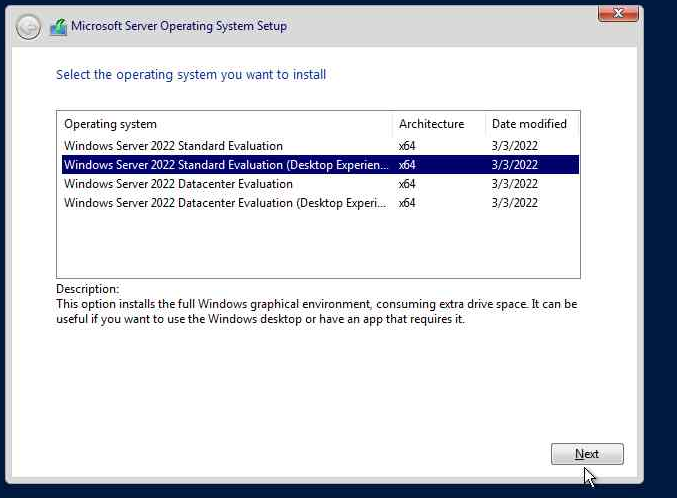
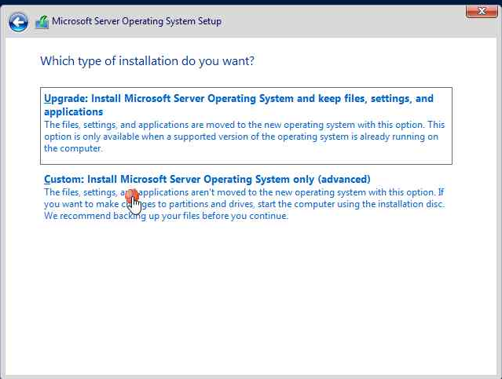
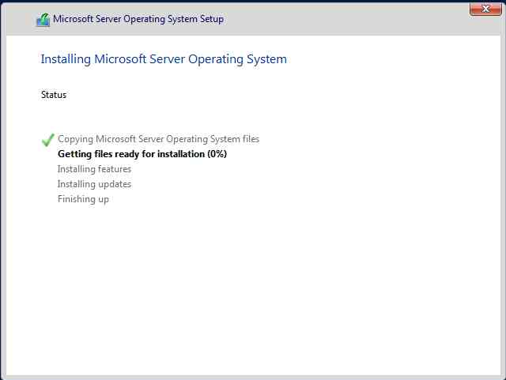
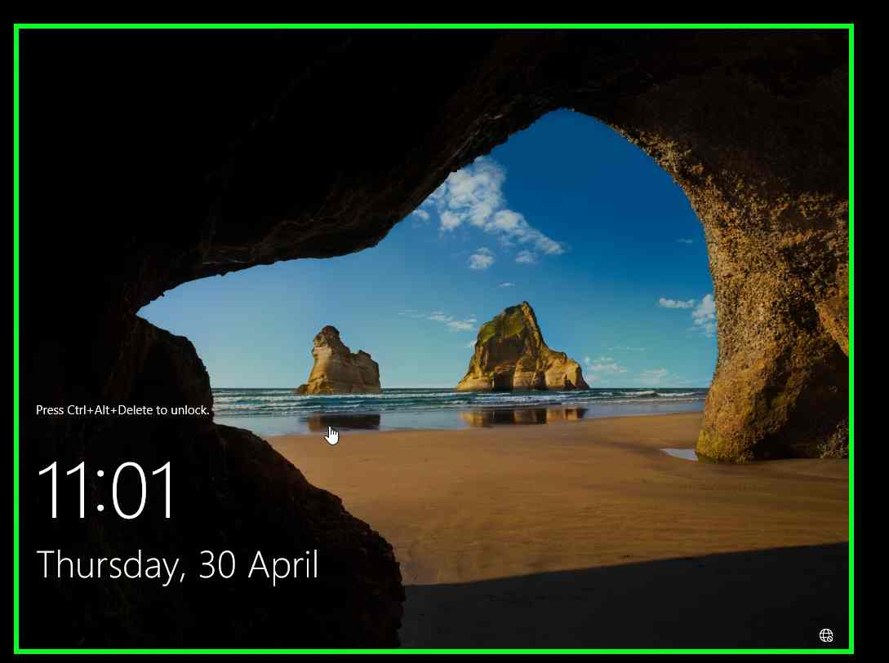
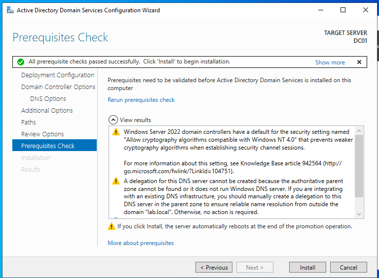

# Windows Server 2022 Installation & Active Directory Setup (DC01)

## Overview
This document outlines the complete process of building a Windows Server 2022 Domain Controller (DC01) using VMware Workstation Pro, including virtual machine setup, OS installation, and Active Directory Domain Services (AD DS) deployment.

---

# 🖥️ Virtual Machine Creation

### 1. Create New VM



- Open VMware Workstation Pro
- Select **Create a New Virtual Machine**
- Choose **Typical (Recommended)**

---

### 2. Boot from ISO



- Power on VM
- Press **ESC** → Boot Menu
- Select **CD/DVD Drive**

---

### 3. Windows Setup



- Select language → Next
- Click **Install Now**

---

### 4. Windows Installed



- Installation complete
- Login as Administrator

---

# ⚙️ Hardware Configuration

- CPU: 2 cores  
- RAM: 4 GB  
- Disk: 60 GB (NVMe)  
- Network: **VMnet1 (Host-only)**  

---

# ⚠️ Pre-Installation Configuration

### Remove Floppy Drive
- VM Settings → Remove Floppy  or power off connection
- Prevents installation errors  

### Configure ISO
- Mount Windows Server 2022 ISO  
- Enable:
  - Connected  
  - Connect at power on  

---

# 🌐 Network Configuration

- Set static IP:

```plaintext
IP Address: 10.10.10.10
Subnet Mask: 255.255.255.0
DNS Server: 10.10.10.10

```
#  Active Directory Domain Services (AD DS) Installation


- Review all configuration settings before installation
- Ensure everything is correct

---



- Verify prerequisite checks
- Ignore warnings if no critical errors are present

---

This is the **actual step where Active Directory is installed**.

- Click **Install**
- The system will:
  - Promote DC01 to a Domain Controller
  - Install Active Directory Domain Services
  - Configure DNS automatically
  - Create the domain `lab.local`

---

### After Installation

- The server will restart automatically
- Active Directory is now fully installed and configured
