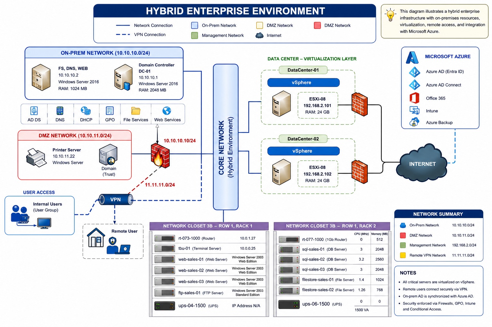

# Hybrid AD & Azure Enterprise Lab

## Overview
This project demonstrates the design and implementation of a hybrid enterprise IT environment combining on-premises infrastructure with Microsoft Azure services.

The lab simulates a real-world corporate network including Active Directory, Group Policy, networking services, Azure AD (Entra ID), Microsoft Intune, and security configurations.

---

## Architecture

---

## Key Components
- Active Directory Domain Services (AD DS)
- Group Policy Management
- DNS & DHCP Configuration
- File and Print Services
- Azure AD (Entra ID) Integration
- Microsoft Intune (Endpoint Management)
- Multi-Factor Authentication (MFA)
- Conditional Access Policies
- PowerShell Automation

---

## Lab Structure
- 01-setup → Environment setup and configuration
- 02-active-directory → AD DS setup and management
- 03-group-policy → Security and policy configuration
- 04-networking → DNS, DHCP, and network setup
- 05-azure → Azure AD and cloud integration
- 06-intune → Device management and compliance
- 07-security → MFA and Conditional Access
- 08-automation → PowerShell automation
- 09-scenarios → Real-world troubleshooting scenarios

---

## Scenarios Implemented
- User login and authentication issues
- Group Policy not applying
- DNS resolution failures
- Azure AD sync troubleshooting
- Intune compliance issues
- VPN connectivity troubleshooting

---

## Technologies Used
- Windows Server 2025
- Windows 10/11
- VMware Workstation Pro
- Microsoft Azure (Entra ID)
- Microsoft Intune
- PowerShell

---

## Author
Ahmed Bamakhram
